# Take One Studio — Architecture & Pipeline Map

> **Pipeline restructure (2026-06-10, evening):** the pipeline is now
> **Script · Breakdown · AG · Storyboard · SG · Final Cut & Export**. Stage 4 is the
> new Storyboard stage (`frontend/features/stage4-storyboard/StoryboardView.tsx`,
> `/api/storyboard/generate|qc` in `server.py`); the old text-only Scene Breakdown
> review was deleted — its camera/dialogue review and Camera Director QC gate moved
> into the Storyboard stage. Decisions of record:
> - **Grid over sequential generation:** one monochrome pencil grid image per scene
>   (≤12 panels, exact uniform cells → deterministic per-panel crops), because
>   `sequential_image_generation` guarantees neither labels nor layout and burns
>   panel slots against the inputs+outputs≤15 budget (MODEL_AUDIT D1).
> - **Migration:** same persist key, zustand `version: 2` + `migrate` — stages
>   1-3/5/6 preserved, old stage-4 payload reset (meaning changed). Verified by an
>   e2e test seeding the v0 format.
> - **Approval granularity:** storyboard approval is **per scene** (`sceneStates`);
>   `approvedShotIds` remains in the store but is no longer load-bearing — its only
>   consumer was the deleted stage's lock button.
> - **SG consumes the board:** keyframe refs are now `[headshot, full body, env,
>   shot's panel crop]` with explicit addressing; a per-shot **Storyboard mode**
>   (SB MODE badge) uses Seedance reference mode `[grid, headshot, full body]` +
>   Define-subject + stay-in-frame constraint — the environment ref is deliberately
>   omitted there (verified live: an empty-room env ref pulls the model into an
>   empty establishing shot). Storyboard approval is a second hard gate before SG.
>
> Diagrams below this note still describe the pre-restructure stage 4 and are
> retained for the unchanged stages; refresh pending.

> Refreshed 2026-06-10 against the code at commit `1d6eee6` (consistency-mission series).
> Every node cites a real file, function, or endpoint. Where reality differs from the
> previous version of this document or from past status reports, reality is documented
> and the discrepancy noted. Model-capability gaps live in [MODEL_AUDIT.md](MODEL_AUDIT.md).

---

## 1. System Overview

```mermaid
flowchart TD
    subgraph Browser["Browser (Next.js 16.2.7, React 19)"]
        STORE["Zustand store\nfrontend/store/pipeline.store.ts\nfrontend/store/agents.store.ts"]
        PAGES["dashboard/page.tsx\nStage views 1–6 + Studio"]
        SSE_CLIENT["AgentSocketBridge (EventSource)\ndashboard/page.tsx"]
    end

    subgraph Backend["FastAPI backend :8000\nserver.py"]
        SSE_BUS["AgentEventBus\nserver.py:84"]
        SCRIPT_EP["POST /api/script/generate · /api/script/qc"]
        BD_EP["POST /api/breakdown/generate · /api/breakdown/qc"]
        ASSET_EP["POST /api/assets/generate · /api/assets/qc\nPOST /api/assets/doctor-prompt (LIVE — see §7 discrepancies)\nPOST /api/assets/environment-angles"]
        KF_EP["POST /api/video/keyframe\n(strict refs + disk save)"]
        VIDEO_EP["POST /api/video/create\nGET  /api/video/poll/{task_id}\nPOST /api/shot/save-video  ← NEW"]
        SCENE_EP["POST /api/scene/qc\nPOST /api/finalscene/qc (ffmpeg frame + vision)\nPOST /api/finalcut/qc"]
        EDIT_EP["POST /api/edit/save-edl · /api/edit/render"]
        PROJ_EP["POST /api/project/init · GET /api/project/list\nGET /api/project/storage-default"]
        ASSET_SAVE["POST /api/asset/save-version (returns local_path)\nGET /api/asset/serve?path=…  ← stable, mimetype-aware\nGET /api/asset/versions · POST /api/asset/revert\nPOST /api/asset/approve-version"]
    end

    subgraph Claude["Anthropic Claude API"]
        CLAUDE_MODEL["claude-sonnet-4-6\nclaude_agents.py:16"]
    end

    subgraph ModelArk["BytePlus ModelArk — byteplus_generative.py\nbase_url default: ark.ap-southeast.bytepluses.com/api/v3\n(eu-west also offers seedream-5-0-lite per docs; never activated here)"]
        SEEDREAM["Seedream 5.0\nseedream-5-0-260128\nbyteplus_generative.py:505"]
        SEEDANCE["Seedance 2.0\ndreamina-seedance-2-0-260128\nbyteplus_generative.py:877"]
        VISION["Vision QC\nseed-2-0-pro-260328\nbyteplus_generative.py:221"]
        EMBED["skylark-embedding-vision-251215\n/embeddings/multimodal\nbyteplus_generative.py:222"]
        DEEPSEEK["deepseek-v4-flash-260425\n⚠️ DEAD PATH — call_deepseek() never used by the\nlive pipeline (server.py routes language to Claude);\nonly rag_engine.py (legacy Streamlit app.py) uses it"]
    end

    subgraph FS["Local filesystem — storage.py"]
        ROOT["TAKEONE_ROOT\n$TAKEONE_HOME or ~/Documents/TakeOne\nstorage.py:10"]
        PROJ_DIR["<project>/\n  project.json\n  Script/  Breakdown/\n  Assets/<type>/<name>/Versions/vNNN.png\n  Shots/<shotId>/Keyframes/Versions/vNNN.png  ← NEW\n  Shots/<shotId>/video_vNNN.mp4               ← NEW\n  Edits/*.edl.json   Exports/render_*.mp4"]
    end

    PAGES --> SCRIPT_EP & BD_EP & ASSET_EP & KF_EP & VIDEO_EP & SCENE_EP & EDIT_EP & PROJ_EP & ASSET_SAVE
    SSE_CLIENT --> SSE_BUS
    SCRIPT_EP & BD_EP & SCENE_EP --> CLAUDE_MODEL
    ASSET_EP --> CLAUDE_MODEL & SEEDREAM & VISION & EMBED
    KF_EP --> SEEDREAM
    VIDEO_EP --> SEEDANCE
    SCENE_EP -->|"frame extract"| FFMPEG["ffmpeg — FFMPEG_BIN resolution\nserver.py:17-44"]
    SCENE_EP --> VISION
    EDIT_EP --> FFMPEG
    PROJ_EP & ASSET_SAVE & KF_EP & VIDEO_EP & SCRIPT_EP & BD_EP & EDIT_EP --> FS
```



**Key points (verified in code):**
- CORS locked to `localhost:3000` (`server.py:139`). Lazy singletons for both API clients (`server.py:68-79`).
- `BYTEPLUS_BASE_URL` defaults to ap-southeast-1 (`byteplus_generative.py:183-186`). Per the Seedream docs the 5.0 model is also live in eu-west-1, but keys/activation are region-scoped and this install has never switched.
- All reference images and first frames are converted to base64 data URIs before hitting ModelArk; local absolute paths and `file://` are read from disk directly (`byteplus_generative.py:27-69`), with a **strict variant that raises on unreachable refs** used by the keyframe endpoint (`byteplus_generative.py:72-87`).

---

## 2. Pipeline Flow (Six Stages + Gates)

```mermaid
flowchart TD
    START([User: concept + target length + style + storage root\nProjectSetupPanel.tsx])
    START --> S1

    subgraph S1["Stage 1 — Script · ScriptIngestionView.tsx"]
        S1_GEN["POST /api/script/generate\nclaude.generate_script(concept, target_duration_secs)\nlength guidance scales shots/scenes — claude_agents.py:213-265"]
        S1_QC["POST /api/script/qc\n⚠️ STILL LIVE BUG: concept arg = script[:200]\nserver.py:302 ← ScriptIngestionView.tsx:73"]
    end
    S1 --> G1{{"Film Director gate — ADVISORY\nQC failure warns, never blocks Approve"}}
    G1 --> S2

    subgraph S2["Stage 2 — Breakdown · BreakdownView.tsx"]
        S2_GEN["POST /api/breakdown/generate\nclaude.generate_breakdown(script, target)\nREQUIRES per-shot 'camera' (claude_agents.py:295-297)\nTRUNCATION GUARD: stop_reason check → retry @8192 →\nclear error, never parses cut JSON (claude_agents.py:317-339)"]
        S2_NORM["normalizeBreakdown: snake→camel,\ncamera→cameraAngle (BreakdownView.tsx:56),\nscenes synthesized from shot.scene headings\n⚠️ shot.sceneId holds the HEADING, scene.id is 'SC-NN'"]
    end
    S2 --> G2{{"Producer gate — ADVISORY"}}
    G2 --> S3

    subgraph S3["Stage 3 — Asset Generation · AssetGenerationView.tsx"]
        S3_DR["Prompt doctor runs BEFORE every generation\nAssetGenerationView.tsx:155 → claude.doctor_prompt\n(old doc called this dead — wrong since Tier-0 commit 632765d)"]
        S3_GEN["POST /api/assets/generate → Seedream\ncharacter → 4-view sheet + composite (byteplus_generative.py:676)\nother → 4 parallel variations (byteplus_generative.py:518)\nauto vision+embedding QC after each"]
        S3_APPROVE["Approve → /api/asset/save-version →\nlocalPath stored on assetState (AssetGenerationView.tsx:265-281)\nLock commits assets AND assetStates (AssetGenerationView.tsx:284-300)"]
    end
    S3 --> G3{{"Art Director gate — ADVISORY with override badge"}}
    G3 --> S4

    subgraph S4["Stage 4 — Scene Breakdown · SceneBreakdownView.tsx"]
        S4_NAV["Scene navigator filters via scene.shotIds\n(SceneBreakdownView.tsx:63-65, 164)\nFIXED: was comparing scene.id vs heading → false empty state"]
        S4_QC["POST /api/scene/qc per shot (manual)"]
        S4_APPROVE["approveShot → store.approvedShotIds (persisted)\npipeline.store.ts:114-117 — survives navigation;\ncleared when Stage 2 commits a new breakdown (pipeline.store.ts:157)"]
    end
    S4 --> G4{{"Camera Director gate — HARD per shot:\nApprove disabled until QC ran (SceneBreakdownView.tsx)"}}
    G4 --> S5

    subgraph S5["Stage 5 — Shot Generation · FinalGenView.tsx"]
        S5_GATE["HARD GATE: every character + environment asset must be\napproved (live assetStates, lock data fallback) —\nbanner names blockers, testid stage5-gate-message\nFinalGenView.tsx:75-108, 354-357, 465-468"]
        S5_KF["Generate Keyframes (Seedream) — keyframes ONLY,\nno auto-animation. Refs = assetsUsed→approved images\n(localPath preferred), char first w=0.9, env w=0.65,\nstrict resolution (502 on dead ref), saved to disk\nserver.py:555-651"]
        S5_ROW["KeyframePreviewRow: all stills together,\nper-still Animate + Animate All — nothing reaches\nSeedance unapproved. KeyframePreviewRow.tsx:31"]
        S5_VID["Animate: keyframeLocalPath → first_frame (i2v)\nassemble_video_prompt w/ camera slot — server.py:655-705\nAudio content-filter false positive → one retry with\ngenerate_audio=false (FinalGenView.tsx:295-309)"]
        S5_SAVE["On completion: POST /api/shot/save-video →\nShots/<id>/video_vNNN.mp4 (FinalGenView.tsx:313-320)"]
        S5_QC["POST /api/finalscene/qc: ffmpeg extracts frame @1s →\nModelArk vision observations → Animation Director verdict\nserver.py:752-823, claude_agents.py:396-432\n(Claude cannot watch video; the frame analysis is the evidence)"]
    end
    S5 --> G5{{"Animation Director gate — ADVISORY with override"}}
    G5 --> S6

    subgraph S6["Stage 6 — Cut & Edit · DeliveryView.tsx"]
        S6_EDL["EDL prefers videoLocalPath over CDN URL\nDeliveryView.tsx:117-125"]
        S6_RENDER["POST /api/edit/render — ffmpeg concat/xfade;\nlocal clip paths copied, URLs downloaded (server.py:817-836)\n720p/1080p/4K/ProRes"]
        S6_QC["POST /api/finalcut/qc (manual)"]
    end
    S6 --> G6{{"Film Director gate — ADVISORY"}}
    G6 --> DONE([Exports/render_*.mp4])
```



**Gate types at a glance:**

| Gate | Type | Enforced where |
|---|---|---|
| Stages 1, 2, 6 QC | Advisory | QC warning shown; Approve never blocked |
| Stage 3 QC | Advisory + explicit "Override & Approve" | [AssetGenerationView.tsx:572-596](frontend/features/stage3-assets/AssetGenerationView.tsx#L572-L596) |
| Stage 4 per-shot | Hard (QC must have run) | Approve `disabled={!qcState.result}` |
| **Stage 5 asset gate** | **Hard block, names blockers** | [FinalGenView.tsx:100-108](frontend/features/stage5-final-gen/FinalGenView.tsx#L100-L108) + guards in every generation handler |
| Stage 5 keyframe gate | Hard by construction | animation only reachable from `keyframe_ready` stills; missing keyframe aborts ([FinalGenView.tsx:252-257](frontend/features/stage5-final-gen/FinalGenView.tsx#L252-L257)) |

---

## 3. Model-Routing Table

| Step | Model ID | Where called | Notes |
|---|---|---|---|
| Script gen | `claude-sonnet-4-6` | `claude_agents.py:generate_script` (213) | duration-aware shot/scene budgeting |
| Breakdown gen | `claude-sonnet-4-6` | `claude_agents.py:generate_breakdown` (267) | camera required; truncation guard (317-339) |
| Prompt doctor | `claude-sonnet-4-6` | `claude_agents.py:doctor_prompt` (165) | **LIVE** — called per asset generation ([AssetGenerationView.tsx:155](frontend/features/stage3-assets/AssetGenerationView.tsx#L155)). Previous doc marked it dead; that was already stale when written |
| QC personas (6 gates) | `claude-sonnet-4-6` | `claude_agents.py:_run` (118) | skill files `skills/qc/*.md` override inline `_PERSONAS` |
| Final-scene QC vision input | `seed-2-0-pro-260328` | `server.py:795-823` → `analyze_image_vision` (316) | judged frame extracted by ffmpeg (`server.py:752`) |
| Asset images / keyframes | `seedream-5-0-260128` | `generate_image` (453); keyframe `server.py:555` | refs via **undocumented** `extra_body.ref_images`, capped 4 — see MODEL_AUDIT S1/S3 |
| Character sheet | `seedream-5-0-260128` | `generate_character_sheet` (676) | front view first, others seeded from it (w=0.85), Pillow composite |
| Environment angles | `seedream-5-0-260128` | `generate_environment_angles` (548) | 5 concurrent |
| Shot video | `dreamina-seedance-2-0-260128` | `create_video_task` (774) | i2v `first_frame`; `resolution:"720p"`, `ratio:"adaptive"` hardcoded (879-880); `generate_audio` retry param (784) |
| Style drift | `skylark-embedding-vision-251215` | `_multimodal_embed` (224), `compute_style_drift` (260) | no `instructions`/`dimensions` set — see MODEL_AUDIT E1 |
| ~~DeepSeek~~ | `deepseek-v4-flash-260425` | `call_deepseek` (367) | dead in live pipeline; `rag_engine.py` (Streamlit-only) |
| ffmpeg | n/a | render (`server.py:793` area), QC frame extract (`server.py:752`) | binary via `_find_ffmpeg()` (`server.py:17-44`) |

API clients: Seedream + vision through the OpenAI SDK against ModelArk; Seedance tasks and embeddings through raw `requests` (`byteplus_generative.py:190-211`, 806, 236). `SEEDDREAM4_API_KEY` env optionally splits the image key from `BYTEPLUS_API_KEY` (187).

---

## 4. "Generate One Shot" Sequence (current flow)

```mermaid
sequenceDiagram
    actor User
    participant FGV as FinalGenView.tsx
    participant SRV as server.py
    participant BPG as byteplus_generative.py
    participant DREAM as Seedream 5.0
    participant DANCE as Seedance 2.0
    participant FS as Disk

    Note over FGV: GATE: generationLocked? → blocked with named assets<br/>FinalGenView.tsx:354-357
    User->>FGV: Generate Keyframes (or per-shot Regenerate)
    FGV->>FGV: assetsUsed → approvedAssetUrls (localPath ?? selectedUrl)<br/>chars first; unresolved char/env ref → abort shot<br/>FinalGenView.tsx:362-383
    FGV->>SRV: POST /api/video/keyframe<br/>{desc, action, subject_hint="Name: full description",<br/>approved_asset_urls, style, project_name/path}
    SRV->>BPG: resolve_reference_strict per ref — dead ref → 502<br/>server.py:585-597
    SRV->>BPG: assemble_image_prompt(desc, style_suffix, context)<br/>server.py:575-579
    BPG->>DREAM: images.generate(seedream-5-0-260128, size=2K,<br/>extra_body.ref_images=[char w=0.9, env w=0.65, anchors w=0.5])<br/>⚠️ generate_image slices refs[:4] — anchors can drop silently
    DREAM-->>SRV: keyframe_url (CDN, 24h)
    SRV->>FS: save Shots/<id>/Keyframes/Versions/vNNN.png<br/>server.py:623-636
    SRV-->>FGV: {keyframe_url, keyframe_local_path, ref_count}
    FGV->>FGV: status=keyframe_ready → KeyframePreviewRow

    User->>FGV: Animate (per still) / Animate All
    FGV->>SRV: POST /api/video/create<br/>imageUrl = keyframeLocalPath (disk, never expires)<br/>shot_action, cameraAngle, durationSecs, generate_audio=true
    SRV->>BPG: assemble_video_prompt → "Subject. Action. Env. Camera. Style.<br/>Preserve composition and colors." + negative list
    BPG->>DANCE: POST /contents/generations/tasks<br/>content=[text, {image_url(data URI), role:first_frame}]<br/>reference_image items DROPPED in i2v (byteplus_generative.py:856-861)
    DANCE-->>FGV: task_id → pollUntilDone (24×5s; real error surfaced)
    alt failure matches /audio…sensitive/
        FGV->>SRV: retry once with generate_audio=false<br/>FinalGenView.tsx:295-309
    end
    DANCE-->>FGV: video_url (CDN, 24h)
    FGV->>SRV: POST /api/shot/save-video → Shots/<id>/video_vNNN.mp4
    FGV->>SRV: POST /api/finalscene/qc {videoLocalPath, real action+description}
    SRV->>SRV: ffmpeg frame @1s → vision obs → Animation Director verdict
    Note over FGV: every shots[] change patched into store →<br/>survives navigation (FinalGenView.tsx:154-157)
```

---

## 5. State & Persistence Map

### Zustand store (`frontend/store/pipeline.store.ts`, persist key `takeone-pipeline-v1`)

```
PipelineStore (persisted)
├── projectId / projectName / projectType / projectStructure
├── activeStage
├── style                ProjectStyle
├── targetDurationSecs
├── localFolderRoot
├── approvedShotIds      string[]   ← Stage 4 approvals (pipeline.store.ts:55)
│      cleared on Stage-2 commit (157) and resetPipeline (213)
└── stages 1-6 (ring buffer, 20 versions each)
    Stage 2 data: BreakdownData {assets[], shots[] (incl. cameraAngle), scenes[]}
    Stage 3 data: {assets: {…selectedUrl,imageUrls,localPath},
                   assetStates: {…status,selectedUrl,localPath,qcResult}}
                   ← assetStates now ALSO included in the lock commit
                     (AssetGenerationView.tsx:284-300) — Stage 5's gate reads it
    Stage 4 data: {approvedShots[], shots[]}
    Stage 5 data: {shots: GeneratedShot[]}
                   GeneratedShot += keyframeLocalPath, videoLocalPath,
                   keyframeRefCount (pipeline.types.ts:106-121)
                   patched on EVERY change (FinalGenView.tsx:154-157)
```

`partialize` strips `data:` URIs before serialization (quota guard) and persists `approvedShotIds` (`pipeline.store.ts:210-249`). Corrupt entries cleared on rehydrate failure.

### Component-local state (still lost on unmount)

| Component | Local state | Notes |
|---|---|---|
| `SceneBreakdownView.tsx` | `shotQC`, `expandedShots`, `feedback` | approvals are NOT here anymore (moved to store) — QC results still reset on navigation |
| `FinalGenView.tsx` | `shotQcResults`, `shotRefMedia` | shots themselves persist via patch; QC verdicts and reference media don't |
| `DeliveryView.tsx` | `sequence`, `clipSettings`, `qcResult` | lost on navigation |
| `EnvironmentAnglesPanel.tsx` | angles, top view | lost on collapse |

### Disk layout (per project)

```
<root>/<project>/
├── project.json
├── Script/script.json + script.txt
├── Breakdown/breakdown.json + asset_breakdown.csv
├── Assets/<Type>/<Name>/Versions/vNNN.png        ← on approval (save-version)
├── Shots/<SHOT_ID>/Keyframes/Versions/vNNN.png   ← every keyframe (server.py:623-636)
├── Shots/<SHOT_ID>/video_vNNN.mp4                ← every finished render (storage.py:118-127)
├── Edits/*.edl.json
└── Exports/render_<ts>_<res>.mp4
```

**Resolved since the previous doc version:** shot videos and keyframes ARE saved to disk now; Stage 4 approvals persist; Stage 5 QC descriptions are real. **Still not saved:** per-asset `meta.json` (spec 1.2, never implemented), Stage 4/5 QC verdicts, Seedance `seed` values (not even captured from the poll response — see MODEL_AUDIT V3).

---

## 6. The Two Prompt Assemblers

Both module-level in `byteplus_generative.py`; no generation call bypasses them.

### `assemble_image_prompt()` — byteplus_generative.py:94-113
`raw_description [+ extra_context] [+ style_suffix]`, comma-joined. Used by `/api/assets/generate` (`server.py:378-382`) and `/api/video/keyframe` (`server.py:575-579`). The keyframe's `extra_context` carries `scene: <action>, <subject_hint>, <env_hint>` where `subject_hint` is now **`Name: full visualDescription`** ([FinalGenView.tsx:385-391](frontend/features/stage5-final-gen/FinalGenView.tsx#L385-L391)) — the text channel reinforcing what the image refs anchor. Not used by `generate_character_sheet` / `generate_shot_concept_art` (inline prompts).

### `assemble_video_prompt()` — byteplus_generative.py:116-173
`Subject. Action. Environment. Camera. Style. Preserve composition and colors.` + negative list `(jitter, bent limbs, warping, identity drift, …)`. Used only by `/api/video/create` (`server.py:661-669`). The `camera` slot is now fed from the breakdown's per-shot camera instruction (`server.py:661`).

**Known deviations from the official Seedance prompt guide** (full analysis: MODEL_AUDIT §2.3): the `lighting_hint` parameter exists (`byteplus_generative.py:122`) but **no caller passes it**; there is no image-quality slot; dialogue from the breakdown never reaches the prompt; the negative list rides an undocumented `negative_prompt` body field instead of documented in-prompt constraint words.

---

## 7. Known Fragility / Improvement Surface

### Fixed since the previous version of this document (discrepancy log)

| Old claim | Reality now |
|---|---|
| "Prompt doctor DEAD — never called" | Was already live when the old doc was written ([AssetGenerationView.tsx:155](frontend/features/stage3-assets/AssetGenerationView.tsx#L155)); old doc was wrong |
| "`qcFinalScene(..., shot.shotId)` — QC gets no description" | Real action+description, local video path, frame-vision evidence (`FinalGenView.tsx:163-185`, `server.py:795-823`) |
| "Stage 4 `approvedShots` lost on navigation" | Store-persisted `approvedShotIds` (`pipeline.store.ts:55,114-121,248`) |
| "Scene click → 'No shots in breakdown'" | Filter fixed via `scene.shotIds` (`SceneBreakdownView.tsx:63-65`) |
| "Shot videos/keyframes not on disk; CDN 403 after 24 h" | Saved to `Shots/<id>/…` (`server.py:623-636`, `731-750`); EDL prefers local paths (`DeliveryView.tsx:121`) |
| "Breakdown truncation unguarded" | stop_reason check + retry + clear error (`claude_agents.py:317-339`) |
| "Generate All auto-animates blind" | Keyframes-first with preview-row approval (`FinalGenView.tsx:352-381`, `KeyframePreviewRow.tsx`) |
| "Breakdown CAMERA column always empty" | Required `camera` field, normalised to `cameraAngle` (`claude_agents.py:295-297`, `BreakdownView.tsx:56`) |

### Resolved in the Model Mastery run (2026-06-10, commits after `be1490c`)

Script-QC concept bug; silent style-anchor drop (refs now ride the documented
`image` param, 14-ref ceiling, loud truncation); duration clamp now [4,15];
project aspect ratio end to end (exact-pixel keyframes + Seedance `ratio`,
draft 480p / HD 1080p with replayed `seed`); Seedance `negative_prompt` field
removed (fixed-seed A/B proved it a no-op — constraints ride the prompt);
embedding `instructions` set + dim comment fixed + drift thresholds calibrated
live; storage-root threading for versions/revert/approve/env-angles/EDL/render;
dead `animateShot` ref computation removed. See MODEL_AUDIT.md "Implementation
status" for the full map.

### Empirical API constraints (established live, encode them — they're not all documented)

| Constraint | Evidence |
|---|---|
| i2v (`first_frame`) excludes **ALL** reference media content items — images, videos, AND audio | submit 400 "first/last frame content cannot be mixed with reference media content" (task …9497t); refs/videos dropped loudly, audio rides the top-level field in i2v (`byteplus_generative.py:838-905`) |
| Seedance `negative_prompt` body field is a no-op | fixed-seed A/B, identical output with/without (tasks …rmwld / …lvm5n) |
| Cancel (DELETE) works on QUEUED tasks only; running → 409 | mapped to `running_cannot_cancel` (`byteplus_generative.py` cancel_video_task) |
| Content filters false-positive: Seedance auto-audio ("sensitive"), Seedream face close-ups (`OutputImageSensitive…`) | one-shot retries in `FinalGenView.tsx` (audio-off) and `server.py` derive-headshot |
| Cross-modal video↔image identity cosine ≈ 0.35 on a TRUE match | drift labels calibrated accordingly (`claude_agents.py` qc_final_scene) |

### Live issues (still open)

| Issue | Location | Severity |
|---|---|---|
| `list_projects()` only scans `TAKEONE_ROOT` | `storage.py:176` | Low |
| Backend `/api/video/poll` blocks ≤ 60 s per call while Seedance runs 2–4 min; frontend loop compensates; orphaned `animating` shots are now reconciled on Stage 5 mount | `server.py`, `FinalGenView.tsx` | Low (mitigated) |
| SSE bus: plain list subscribers, queue maxsize 50 drops frames, no event IDs for replay | `server.py:84-115` | Low |
| `ClaudeQCAgents.__init__` raises without `ANTHROPIC_API_KEY`; ModelArk client silently `None` on init failure | `claude_agents.py`, `byteplus_generative.py` | High (first-request failure mode) |
| Hardcoded defaults: project name "NEBULA PROTOCOL Ep. 3" (`pipeline.store.ts:101`), CORS dev origins (`server.py:139`) | | Low |
| Seedream `negative_prompt` extra_body still unverified for images (Seedance's was a no-op) | `byteplus_generative.py` generate_image | Low |
| Stage 5 QC verdicts and reference media still component-local (lost on navigation) | `FinalGenView.tsx` | Low |

### Dead / legacy paths

- `BytePlusGenerativeAPI.call_deepseek / generate_script / generate_breakdown` (`byteplus_generative.py:367-441`) — superseded by Claude equivalents; only `rag_engine.py` (legacy Streamlit `app.py`) still imports DeepSeek.
- `generate_shot_concept_art` (`byteplus_generative.py:595`) — no caller in the live pipeline.
- Inline `_PERSONAS` dict duplicates `skills/qc/*.md` (skill files win when present) — two sources of truth (`claude_agents.py:50-98` vs `skills/qc/`).
